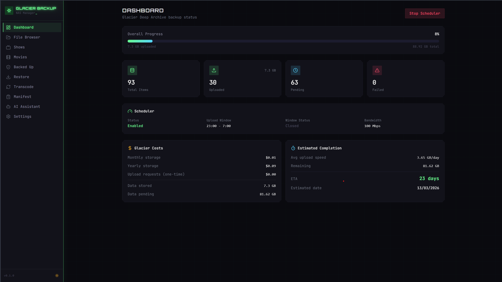

# Glacier Backup Manager

A self-hosted web application for backing up Unraid NAS content to AWS S3 Glacier Deep Archive. Features media-aware file selection, Sonarr/Radarr integration with rarity scoring, NVENC transcoding via a gaming PC worker, nighttime upload scheduling, and a full NAS manifest.

Built for people who want complete control over what gets backed up, when it uploads, and how much it costs.

## Screenshots



*Dashboard with real-time upload speed graph, queue progress, Glacier cost tracking, and estimated completion.*

## Features

- **Dashboard** — Real-time upload progress, queue status, Glacier cost tracker, and estimated completion date
- **File Browser** — Browse NAS filesystem, select files/folders for backup with priority levels (P0 Critical → P3 Low)
- **Shows Manager** — Sonarr integration with automatic rarity scoring (rare/moderate/easy to find)
- **Movies Manager** — Radarr integration with rarity scoring, codec detection, and transcode queueing
- **Transcode Queue** — Queue x264→x265/AV1 transcoding jobs with multiple profiles, processed by a gaming PC worker via NVENC
- **Manifest** — Full searchable inventory of all NAS content with backup status, CSV/JSON export
- **Night Scheduler** — Uploads only during configurable hours (default 11pm–7am) with bandwidth limiting
- **AI Assistant** — Built-in Claude-powered chat with live backup context (bring your own API key)
- **Settings** — Configure AWS credentials, NAS mount path, upload schedule, Sonarr/Radarr, and notifications

## Tech Stack

| Component | Technology |
|-----------|-----------|
| Frontend | Next.js 14 (App Router), React, Tailwind CSS |
| Database | SQLite via better-sqlite3 (WAL mode) |
| Uploads | rclone → AWS S3 Glacier Deep Archive |
| Scheduling | node-cron (nighttime upload windows) |
| Transcoding | ffmpeg with NVENC (runs on gaming PC) |
| Runtime | Node.js 20 LTS |

## Architecture

```
┌─────────────────────────────────────────────┐
│  LXC Container / VM (Debian/Ubuntu)         │
│  ┌───────────────────────────────────────┐  │
│  │  Next.js App (port 3000)              │  │
│  │  ├── Web UI (React + Tailwind)        │  │
│  │  ├── API Routes (REST)                │  │
│  │  ├── SQLite Database                  │  │
│  │  ├── Upload Scheduler (node-cron)     │  │
│  │  └── rclone (S3 Glacier uploads)      │  │
│  └───────────────────────────────────────┘  │
│           │ NFS Mount                        │
└───────────┼─────────────────────────────────┘
            ▼
┌─────────────────────┐     ┌──────────────────────┐
│  Unraid NAS         │     │  Gaming PC (optional) │
│  /mnt/user/...      │◄────│  PowerShell Worker    │
│  (33 TB storage)    │ SMB │  ffmpeg + NVENC GPU   │
└─────────────────────┘     └──────────────────────┘
            │                        │
            │              Polls /api/transcode/worker
            ▼                        │
┌─────────────────────┐              │
│  AWS S3 Glacier     │◄─────────────┘
│  Deep Archive       │  (transcoded files uploaded
│  (~$1/TB/month)     │   via the LXC app)
└─────────────────────┘
```

## Quick Start

### Prerequisites

- **Debian/Ubuntu LXC or VM** (1 GB RAM, 16 GB disk recommended)
  - Node.js 20+
  - rclone
  - NFS client (for mounting NAS)
- **Unraid NAS** with NFS export enabled on relevant shares
- **AWS account** with:
  - An S3 bucket (any region)
  - IAM user with S3 write permissions
  - Bucket default storage class set to Glacier Deep Archive (or the app handles it via rclone)
- **Gaming PC** (optional, for transcoding) with:
  - NVIDIA GPU (RTX series recommended)
  - ffmpeg with NVENC support
  - SMB access to NAS

### Option A: Automated LXC Setup

For a fresh Debian 13 LXC container:

```bash
# 1. Create an LXC in Proxmox (Debian 13, 1GB RAM, 16GB disk, 2 cores)

# 2. SSH in and run the setup script
apt update && apt install -y git
git clone https://github.com/tomganleylee/glacier-backup-manager.git /opt/glacier-backup-manager
cd /opt/glacier-backup-manager
bash scripts/setup-lxc.sh
```

The setup script installs Node.js 20, rclone, NFS client, builds the app, and creates a systemd service. It will prompt you for your NAS IP and share path interactively, or you can pass them as environment variables:

```bash
NAS_IP=192.168.x.x NAS_SHARE=/mnt/user/sharename bash scripts/setup-lxc.sh
```

### Option B: Manual Installation

```bash
# Clone the repo
git clone https://github.com/tomganleylee/glacier-backup-manager.git
cd glacier-backup-manager

# Install dependencies
npm install

# Build the production app
npx next build

# Create the data directory (SQLite DB auto-creates on first run)
mkdir -p data

# Start in production mode
npx next start -p 3000 -H 0.0.0.0
```

### Systemd Service (Auto-Start)

```bash
# Create the service file
cat > /etc/systemd/system/glacier-backup.service << 'EOF'
[Unit]
Description=Glacier Backup Manager
After=network.target

[Service]
Type=simple
WorkingDirectory=/opt/glacier-backup-manager
ExecStart=/usr/bin/npx next start -p 3000 -H 0.0.0.0
Restart=on-failure
RestartSec=10
Environment=NODE_ENV=production

[Install]
WantedBy=multi-user.target
EOF

# Enable and start
sudo systemctl enable --now glacier-backup.service

# Check status
sudo systemctl status glacier-backup
```

### First-Time Configuration

1. Open `http://<your-ip>:3000` in your browser
2. Go to **Settings** and configure:
   - **AWS Credentials** — Access key, secret key, region, and S3 bucket name
   - **NAS Mount Path** — Where your NAS is mounted (e.g., `/mnt/nas`)
   - **Upload Schedule** — Start/end hours and bandwidth limit
   - **Sonarr/Radarr** (optional) — API URLs and keys for media metadata
   - **Claude API Key** (optional) — For the AI assistant feature
3. Go to **Shows** and click **Sync from Sonarr** to import your media library
4. Use the **File Browser** to select files/folders for backup
5. Click **Start Scheduler** on the Dashboard to begin uploads

### NFS Mount on Unraid

On your Unraid server:
1. Go to **Settings → NFS**
2. Enable NFS
3. Edit the share you want to export and set NFS security to "Public" or configure host access

On the LXC:
```bash
# Install NFS client
apt install -y nfs-common

# Create mount point
mkdir -p /mnt/nas

# Mount (replace with your NAS IP and share path)
mount -t nfs 192.168.x.x:/mnt/user/sharename /mnt/nas

# Make persistent (add to /etc/fstab)
echo "192.168.x.x:/mnt/user/sharename /mnt/nas nfs defaults,_netdev 0 0" >> /etc/fstab
```

### AWS S3 Bucket Setup

```bash
# Install AWS CLI (optional, for bucket creation)
apt install -y awscli

# Create bucket (or do this in the AWS Console)
aws s3 mb s3://your-bucket-name --region eu-west-2

# Set default storage class to Glacier Deep Archive (optional lifecycle rule)
# The app uses rclone with --s3-storage-class DEEP_ARCHIVE
```

Pricing (as of 2025):
- **Storage**: ~$0.00099/GB/month (~$1/TB/month)
- **PUT requests**: $0.05 per 1,000 requests
- **Retrieval**: $0.02/GB + $0.10 per 1,000 requests (12-48 hour delay)

## Gaming PC Transcode Worker

The transcode worker runs on your Windows gaming PC and uses NVENC (NVIDIA GPU hardware encoding) to transcode media files from x264 to x265/HEVC, significantly reducing file sizes before upload.

### Setup

1. Install [ffmpeg](https://ffmpeg.org/download.html) and ensure it's in your PATH
2. Ensure your NAS shares are accessible via SMB (e.g., `\\192.168.x.x\sharename`)
3. Run the worker:

```powershell
# Basic usage
powershell -ExecutionPolicy Bypass -File scripts/gaming-pc-worker.ps1 -ServerUrl http://<lxc-ip>:3000

# With custom NAS path mapping
powershell -ExecutionPolicy Bypass -File scripts/gaming-pc-worker.ps1 `
  -ServerUrl http://<lxc-ip>:3000 `
  -NasWindowsPath "\\192.168.x.x\sharename" `
  -TempDir "D:\transcode-temp"
```

The worker:
- Polls the server every 30 seconds for queued transcode jobs
- Downloads/accesses source files from NAS via SMB
- Runs ffmpeg with NVENC hardware encoding
- Reports progress back to the server in real-time
- Copies the transcoded file back to NAS
- Handles Ctrl+C gracefully

### Transcode Profiles

| Profile | Codec | Preset | CQ | Typical Savings | Speed (RTX 5080) |
|---------|-------|--------|-----|----------------|-------------------|
| Balanced | HEVC | p5 | 22 | 40-50% | ~2-3x realtime |
| High Quality | HEVC | p7 | 18 | 30-40% | ~1.5-2x realtime |
| Small Size | HEVC | p5 | 28 | 55-65% | ~3-4x realtime |
| Fast Preview | HEVC | p1 | 24 | 35-45% | ~5-6x realtime |
| AV1 Quality | AV1 | p5 | 30 | 50-60% | ~1-1.5x realtime |

## API Reference

All API routes are under `/api/`:

| Endpoint | Method | Description |
|----------|--------|-------------|
| `/api/settings` | GET/POST | Read/update app settings |
| `/api/files?path=` | GET | Browse NAS filesystem |
| `/api/backup` | GET/POST/DELETE | Manage backup selections |
| `/api/backup/status` | GET | Upload stats + scheduler status |
| `/api/backup/costs` | GET | Glacier cost calculations + ETA |
| `/api/shows` | GET/PATCH | List/update shows |
| `/api/shows/sync` | POST | Sync from Sonarr |
| `/api/shows/scan-codecs` | POST | Detect video codecs for shows |
| `/api/shows/:id/transcode` | POST | Queue show episodes for transcode |
| `/api/movies` | GET/PATCH | List/update movies |
| `/api/movies/sync` | POST | Sync from Radarr |
| `/api/movies/scan-codecs` | POST | Detect video codecs for movies |
| `/api/movies/:id/transcode` | POST | Queue movie for transcode |
| `/api/scheduler` | GET/POST | Scheduler status + start/stop |
| `/api/manifest` | GET | Searchable NAS inventory |
| `/api/manifest/scan` | POST | Scan NAS and populate manifest |
| `/api/manifest/export?format=csv\|json` | GET | Export manifest |
| `/api/transcode` | GET/POST | Transcode job queue |
| `/api/transcode/profiles` | GET/POST/DELETE | Manage transcode profiles |
| `/api/transcode/worker` | GET/POST | Worker poll + progress reporting |
| `/api/assistant` | POST | AI chat (requires Claude API key) |

## Database

SQLite database stored at `data/backup.db` with these tables:

- `settings` — Key-value configuration store
- `backup_items` — Files/folders selected for backup with priority and status
- `shows` — TV shows synced from Sonarr with rarity scores
- `movies` — Movies synced from Radarr with rarity scores
- `upload_log` — Detailed log of every upload attempt
- `transcode_jobs` — Transcode queue with progress tracking
- `transcode_profiles` — Encoding presets (HEVC, AV1, etc.)
- `upload_stats` — Daily upload aggregates
- `manifest` — Full NAS inventory

## Cost Estimates

For a typical 9 TB NAS backup to Glacier Deep Archive:

| Scenario | Data Size | Monthly | Yearly |
|----------|-----------|---------|--------|
| Without transcoding | 9 TB | ~$9.00 | ~$108 |
| With x265 transcoding (~45% reduction) | ~5 TB | ~$5.00 | ~$60 |
| PUT requests (one-time) | — | — | ~$20-50 |

Upload timeline (8-hour nightly window):

| Internet Speed | 9 TB (raw) | 5 TB (transcoded) |
|---------------|------------|-------------------|
| 30 Mbps | ~83 nights | ~46 nights |
| 100 Mbps | ~25 nights | ~14 nights |

## Using with Claude Code

This project was built with [Claude Code](https://claude.com/claude-code) and includes a `CLAUDE.md` file that gives Claude full context about the infrastructure, API endpoints, database schema, and deployment process.

With Claude Code, you can manage your backup system conversationally:

```
> "Check the backup status and tell me how many files uploaded overnight"
> "Queue all my photos for backup with high priority"
> "The scheduler stopped — restart it and check for errors"
> "How much is Glacier costing me this month?"
```

Claude Code can SSH into the LXC, query the database, call API endpoints, deploy code changes, and troubleshoot issues — all from your terminal. The `CLAUDE.md` file tells it how to connect to your infrastructure so it can operate autonomously.

To get started, install [Claude Code](https://claude.com/claude-code) and open this project directory. Claude will read `CLAUDE.md` automatically and understand how to interact with your backup system.

## Contributing

1. Fork the repo
2. Create a feature branch (`git checkout -b feature/my-feature`)
3. Commit your changes
4. Push to the branch
5. Open a Pull Request

## Built With

This project was built with [Claude Code](https://claude.com/claude-code) by Anthropic.

Check out [Kolva](https://kolva.io) — an AI-powered meeting transcription platform with pay-per-hour pricing, plus built-in tasks, documents, and notes. If you're managing a homelab, you probably have too many side projects too.

## License

MIT
